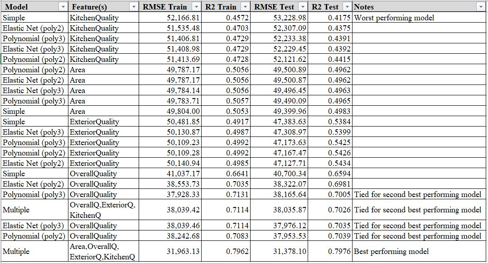

# BeverCapstoneProject
Analysis of Housing Prices Using Machine Learning

Author: Samantha J. Bever

Email: sammie.houfek@gmail.com

School: Northwest Missouri State University

Class: 44-688 Data Analytics Capstone Project

Date: April 21, 2023

## Project Goal
The overall goal of this project was to analyze features that affect housing prices. This included finding correlations between various data features and housing prices. Regression analysis and machine learning techniques were applied in order to analyze these trends. Models were also built to predict the housing price based on specific features of the data. 

## Data Set
Link to data set: https://vincentarelbundock.github.io/Rdatasets/articles/data.html

Using data set called "Housing prices in Ames, Iowa"

## Overleaf Report
This is the written report describing the steps taken during this project and the final results. Further explaination of this repository can be found in this report.

Link to OverLeaf report: https://www.overleaf.com/read/yvgfrmwhpsph

## File Descriptions
- Ames_Housing_Original.csv: This is the original csv file from data source (listed above).
- Ames_Housing_WorkingFile.xlsx: This is the Excel file used to clean the original data into a usable format for analysis. After preliminary cleaning steps were taken in Excel, the data from the "ExcelCleaned" tab was exported to a csv file called "Ames_Housing_Cleaned.csv." The final cleaned data set from Python was later added to this file. The results from the Python notebook analysis were later added to this file as well.
- Ames_Housing_Cleaned.csv: After data was cleaned in the "Ames_Housing_WorkingFile.xlsx" file, the cleaned data was moved to this csv file, which was then imported into the Python notebook called "BeverCapstoneProject.ipynb."
- BeverCapstoneProject.ipynb: This is the Python Notebook used for statistics, visualizations, more data cleaning, and predictive modeling via regression.
- Ames_Housing_Cleaned_Final.csv: The last line of code in the Python notebook called "BeverCapstoneProject.ipynb" exports the final cleaned data set to this csv file. The data from this csv file was added to the Ames_Housing_WorkingFile.xlsx under the tab called "PythonCleanedFinal."

# Results
The results of the regression analysis models created and analyzed in this project can be seen in the table below. Overall, none of the regression models performed as well as expected in predicting the sale price of a home. The results showed that the multiple linear regression model which used all four of the independent variables (area, overall quality, exterior quality, and kitchen quality) performed the best. This model had the highest R-squared value and lowest RMSE, which is ideal. However, if an investor can only afford to put time, effort, and money into one feature of home, it is recommended they spend it on the overall quality of the home as this was the individual factor that was able to predict sale price the best on its own. The worst performing model was simple linear regression using kitchen quality as the independent variable. This model had the highest RMSE score and lowest R-squared value, which is not ideal.

# Limitations
- The data analyzed was only for the years 2006 to 2010. 
- The data analyzed was only for the city of Ames, Iowa.
- The models are only able to predict within the range they were trained on. It is recommended to add limits, such as the min/max of the independent variable being used, to the input variables in order for the model to perform properly.

# Future Work
- Evaluate more of the features included in the original data set as they relate to sale price.
- Collect data from other regions and cities of the United States so the model could be more widely used.
- Research and evaluate inflation rates as they compare to the housing trends seen in this data set.
- Collect and analyze data from more years. It would be ideal to have data from 2010 until present in order to better predict future housing values.

# Tutorials Referenced
- https://www.youtube.com/watch?v=4yI3vVe0Jos
- https://www.youtube.com/watch?v=4yI3vVe0Jos
- https://www.youtube.com/watch?v=-o3AxdVcUtQ
- https://www.youtube.com/watch?v=QWgg4w1SpJ8
- https://www.youtube.com/watch?v=9m4n2xVzk9o
- https://www.youtube.com/watch?v=7O4dpR9QMIM